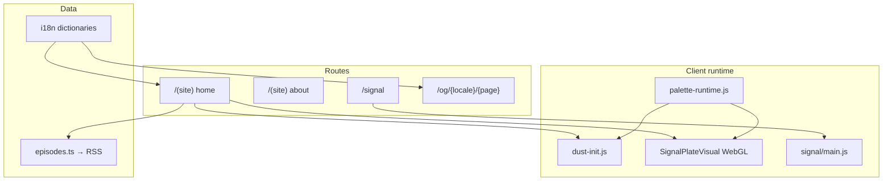

# mxsm.me — ревью v3 + backlog

> **Дата:** май 2026  
> **Контекст:** после закрытия AGENT-TASKS (15/15). Новый аудит текущего состояния.

---

## Health check

| Check | Статус |
|-------|--------|
| `npm run lint` | ✅ 0 errors, 1 warning (`YandexMetrika` noscript ``) |
| `npm test` | ✅ 13/13 |
| `npm run build` | ✅ (после clean `.next`) |

---

## Оценки v3

| Критерий | Оценка | Комментарий |
|----------|--------|-------------|
| Архитектура | **8.5/10** | Чёткое разделение `(site)` / `signal`, i18n, data layer |
| Type safety | **8/10** | Strict TS; `src/signal/` — JS + `runtime.d.ts` |
| SEO | **9/10** | Metadata factory, JSON-LD, sitemap, unified OG route |
| Безопасность | **8/10** | CSP, RSS allowlist, security headers |
| Performance | **8/10** | SSG home, dynamic signal, dust dispose |
| Maintainability | **7.5/10** | Palette SSoT есть; dust GLSL и hsl-логика ещё дублируются |
| Testability | **7/10** | CI + vitest; нет RSS/OG integration tests |
| DX / onboarding | **6.5/10** | `.env.example` в `.gitignore`; README частично устарел |

**Итог:** проект production-ready. Ниже — polish и несколько реальных дыр, не блокеров.

---

## Что сейчас хорошо

### Архитектура

```
app/layout.tsx          → palette-runtime (beforeInteractive), TimePalette
app/[locale]/(site)/    → BackgroundLayers (mxsmDust), plates, about
app/[locale]/signal/    → SignalExperience (main.js boot/dispose)
app/og/[locale]/[page]  → единый OG endpoint (home | about | signal)
```

- **i18n:** middleware rewrite, `resolveLocale()`, typed dictionaries + about split
- **Metadata:** `buildPageMetadata()` + `ogImageUrl()` — DRY
- **Palette:** `palette-stops.json` → `build:palette` → `palette-runtime.js`; TS читает тот же JSON
- **Lifecycle:** `mxsmDust.boot/dispose`, signal `boot/dispose`, WebGL cleanup
- **CI:** lint → test → build на push/PR

### SEO / OG (новое с v2)

- Per-page `generateMetadata` на home / about / signal
- OG images: `/og/{locale}/{page}` вместо разрозненных `opengraph-image.tsx`
- JSON-LD распределён по страницам (Person+Podcast на home, WebSite на layout, и т.д.)

---

## Оставшиеся проблемы

### 🔴 Высокий приоритет

| # | Проблема | Где |
|---|----------|-----|
| H1 | **`.env.example` в `.gitignore`** — файл есть локально, но не попадёт в git (`/.env*` rule) | `.gitignore:21` |
| H2 | **README устарел по OG** — ссылается на удалённые `opengraph-image.tsx` | `README.md:55` |

### 🟡 Средний приоритет

| # | Проблема | Где |
|---|----------|-----|
| M1 | **`buildTicker` хардкодит** `"WITH MIKE ZHARCHEV"` — остаток i18n | `podcast-home.ts:72-73` |
| M2 | **Analytics IDs в 3 файлах** | `GoogleAnalytics`, `YandexMetrika`, `AnalyticsRouteTracker` |
| M3 | **OG route dynamic (`ƒ`)** — можно SSG + cache для 6 комбинаций | `app/og/[locale]/[page]/route.tsx` |
| M4 | **Нет parity test** TS `paletteAt()` vs generated `palette-runtime.js` | tests |
| M5 | **`getEpisodes()` не покрыт** — только helpers, не RSS parse / allowlist | `episodes.test.ts` |
| M6 | **`signal` backHref** — ternary вместо `localePath(locale)` | `signal/page.tsx:51` |
| M7 | **`error.tsx`** — только EN, нет ссылки home, inline styles | `(site)/error.tsx` |
| M8 | **`prebuild` только на build** — fresh clone + `npm run dev` без `palette-runtime.js` если файл не в git | `package.json` |
| M9 | **Dust GLSL inline** ~80 строк в `dust-init.js` — сложно синхронизировать | `public/dust-init.js` |
| M10 | **HSL math дублируется** в `time-palette.ts` и `scripts/build-palette.mjs` | palette pipeline |

### 🟢 Низкий приоритет

| # | Проблема |
|---|----------|
| L1 | Yandex noscript lint warning — suppress или eslint-disable с комментарием |
| L2 | `global-error.tsx` — hardcoded colors, не в стиле site palette |
| L3 | `PlatePodcast` — `key={ep.href}` → лучше `guid` если добавить в list type |
| L4 | CI triggers только `main` — расширить на все ветки (optional) |
| L5 | `formatDuration(3665)` → `"1:01"` (без секунд при h>0) — задокументировать или показывать `1:01:05` |
| L6 | Signal `dispose()` не трогает `#stage` 2D canvas (React-owned) — minor, rAF уже stopped |

---

## Задачи для кодинг-агента

### TASK-1: Fix `.env.example` in git

**Проблема:** `.gitignore` rule `.env*` игнорирует `.env.example`.

**Файлы:** `.gitignore`

**Шаги:**

1. Заменить `.env*` на:

   ```
   .env
   .env.local
   .env.*.local
   !.env.example
   ```

2. Убедиться, что `.env.example` tracked: `git add -f .env.example`

**Критерии:**

- [ ] `git check-ignore .env.example` → not ignored
- [ ] README instruction valid for new clones

---

### TASK-2: Sync README with OG architecture

**Проблема:** README описывает старые `opengraph-image.tsx`.

**Файлы:** `README.md`

**Обновить секцию SEO / OG:**

- Dynamic OG: `app/og/[locale]/[page]/route.tsx` → `/og/ru/home`, `/og/en/signal`, etc.
- `src/lib/seo/og-render.tsx` — shared templates
- Metadata via `buildPageMetadata()` + `ogPage: "home" | "about" | "signal"`

**Критерии:**

- [ ] Нет упоминаний `opengraph-image.tsx`
- [ ] Примеры OG URLs актуальны

---

### TASK-3: Podcast ticker i18n

**Проблема:** `buildTicker()` хардкодит `"WITH MIKE ZHARCHEV"`.

**Файлы:**

- `src/i18n/types.ts`
- `src/i18n/dictionaries/ru.ts`, `en.ts`
- `src/lib/podcast-home.ts`

**Шаги:**

1. Добавить `tickerTemplate: "★ ON AIR · {brand} · S{season} · {with} ·\u00a0"` (или отдельные поля).
2. `buildTicker` → `interpolate(dict.plates.podcast.tickerTemplate, { brand, season, with: p.metaWith })`.
3. Убрать hardcoded string.

**Критерии:**

- [ ] `podcast-home.ts` без locale-specific literals в `buildTicker`
- [ ] RU/EN ticker корректен на home и в RSS fallback

---

### TASK-4: Centralize analytics config

**Файлы:**

- `src/lib/analytics/config.ts` (создать)
- `GoogleAnalytics.tsx`, `YandexMetrika.tsx`, `AnalyticsRouteTracker.tsx`

**Шаги:**

```ts
export const GA_ID = "G-7YXT4BC7FF";
export const YM_ID = 109337094;
```

Import everywhere.

**Критерии:**

- [ ] Grep `G-7YXT4BC7FF` — только `config.ts`

---

### TASK-5: Static OG images + cache

**Файлы:** `src/app/og/[locale]/[page]/route.tsx`

**Шаги:**

1. `export function generateStaticParams()` → 6 combos (`ru|en` × `home|about|signal`).
2. Response headers: `Cache-Control: public, max-age=86400, stale-while-revalidate=604800`.

**Критерии:**

- [ ] Build output: OG routes `○` static (или documented why dynamic)
- [ ] Facebook debugger / curl получает PNG

---

### TASK-6: Palette parity test

**Файлы:** `src/lib/time-palette.test.ts` или `scripts/build-palette.test.mjs`

**Шаги:**

1. После `build:palette`, для `nowMs = 0, cycle/4, cycle/2`:
   - `paletteAt(nowMs).hot` === value from executing generated runtime logic
2. Можно import JSON + duplicate minimal `at()` in test, или eval generated file in vitest.

**Критерии:**

- [ ] Test fails if `palette-stops.json` changed but `npm run build:palette` not run
- [ ] CI runs test after build:palette (already via prebuild)

---

### TASK-7: RSS integration tests

**Файлы:** `src/lib/episodes.test.ts`

**Шаги:**

1. Mock `global.fetch` with minimal RSS XML (2 items, enclosure, itunes tags).
2. Test trusted vs untrusted audio URL filtering.
3. Test oversized body rejection (optional).

**Критерии:**

- [ ] `getEpisodes()` covered with mock fetch
- [ ] ≥ 5 new assertions

---

### TASK-8: Polish error UX + localePath

**Файлы:**

- `src/app/[locale]/(site)/error.tsx`
- `src/app/[locale]/signal/page.tsx`

**Шаги:**

1. Signal: `backHref={localePath(locale)}` instead of ternary.
2. Error: add `<Link href="/">` or locale-aware home link; optional RU copy via minimal dict or hardcoded bilingual one-liner.

**Критерии:**

- [ ] No `locale === "ru" ? "/" : "/en"` in signal page
- [ ] Error page has escape hatch to home

---

### TASK-9: Dev DX — palette on first run

**Проблема:** `prebuild` не runs on `dev`; если `palette-runtime.js` отсутствует — site breaks.

**Файлы:** `package.json`

**Варианты (pick one):**

- A) `"predev": "npm run build:palette"`
- B) Commit generated `palette-runtime.js` (already) + CI check it’s fresh
- C) Document in README: run `build:palette` after clone

**Рекомендация:** A + B (predev is cheap, ~50ms).

**Критерии:**

- [ ] Fresh clone + `npm run dev` works without manual steps

---

### TASK-10: Extract dust shader source

**Проблема:** GLSL embedded as string in `dust-init.js`.

**Файлы:**

- `public/dust.frag.glsl` or `src/lib/dust-shader.glsl` (copied at build)
- `public/dust-init.js`
- optional: extend `build-palette.mjs` → `build-assets.mjs`

**Шаги:**

1. Extract FRAG shader to file.
2. `dust-init.js` loads via inline at build time (same pattern as palette) OR fetch at runtime (extra request — worse).

**Prefer:** build step inlines shader into `dust-init.js` from source file.

**Критерии:**

- [ ] No multi-line GLSL string literals in hand-edited JS
- [ ] Visual unchanged

---

### TASK-11: Suppress Yandex noscript lint

**Файл:** `src/components/analytics/YandexMetrika.tsx`

```tsx
{/* eslint-disable-next-line @next/next/no-img-element -- Yandex Metrika noscript pixel */}

```

**Критерии:**

- [ ] `npm run lint` — 0 warnings

---

## Порядок выполнения

| Wave | Tasks | Effort |
|------|-------|--------|
| 1 | TASK-1, TASK-2, TASK-11 | ~30 min |
| 2 | TASK-3, TASK-4, TASK-8 | ~1 h |
| 3 | TASK-5, TASK-6, TASK-7 | ~2 h |
| 4 | TASK-9, TASK-10 | ~2 h (optional polish) |

---

## Definition of Done

- [ ] `npm run lint` — 0 errors, 0 warnings (after TASK-11)
- [ ] `npm test` — all pass
- [ ] `npm run build` — success
- [ ] README matches code (after TASK-2)

---

## Архитектурная диаграмма (v3)



---

## Эпик (отдельно от TASK-1…11)

- **[SIGNAL-TS-MIGRATION.md](./SIGNAL-TS-MIGRATION.md)** — полная миграция `src/signal/` на TypeScript (~2.6k LOC).  
  **Фаза 0–1:** `types.ts`, `phrases.ts`, `audio/helpers.ts` — в работе.  
  Дальше: `text-layer` → `audio` → `visual-unstable` → `main.ts`.

## Не таскать (осознанно out of scope)
- CSP nonce-based (большой рефакторинг)
- Static export / edge deploy
- E2E Playwright tests
- Удаление `legacy/` (архив, не мешает)
